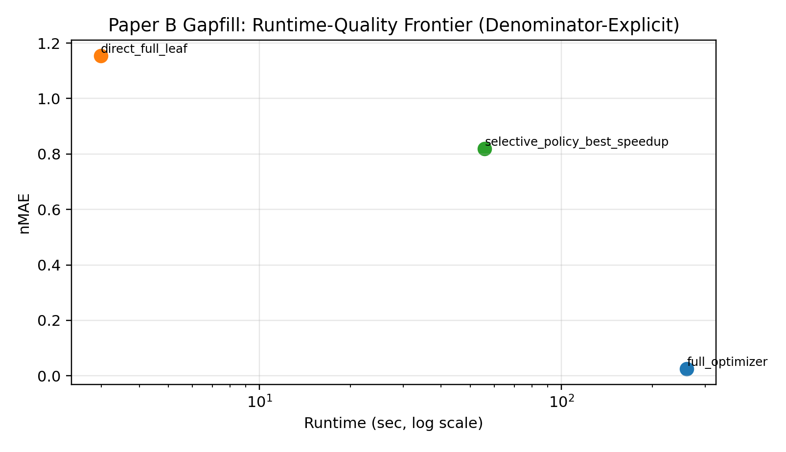
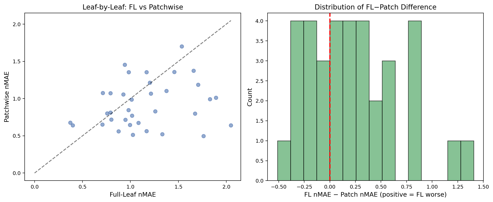
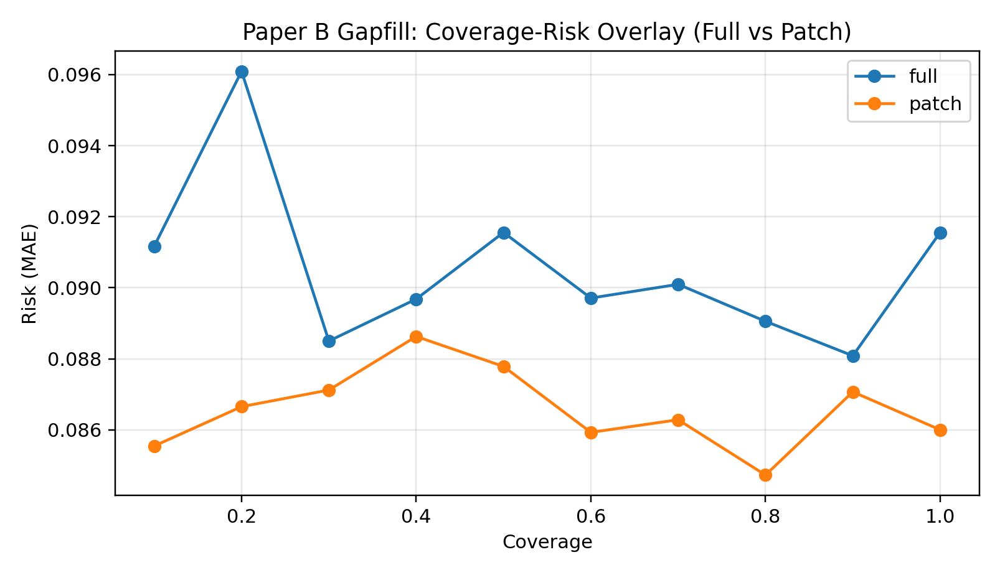

#+TITLE: Black-Box Selective Semi-Amortized Inference for Runtime—Quality Tradeoffs in Physics-Based Lesion Phenotyping
#+AUTHOR: Chimdi Walter Ndubuisi and Toni Kazic
#+OPTIONS: toc:2 num:t

- Compiled PDF :: [[file:paper2_v2_final.pdf][paper2_v2_final.pdf]]
- LaTeX source :: [[file:main_paper2_v2.tex][main_paper2_v2.tex]]
- Figures dir :: [[file:figures/][figures/]]

* Abstract
Physics-based lesion phenotyping produces interpretable seven-parameter summaries per leaf, but the underlying optimizer requires roughly 260 seconds per image. This paper addresses the resulting deployment bottleneck through black-box selective semi-amortized inference, combining direct learned prediction, patchwise aggregation, and uncertainty-guided routing into a unified runtime—quality framework. On a matched 35-leaf comparison, direct full-leaf prediction has  1.154, while patch aggregation improves on that baseline, reaching 0.906 with simple mean aggregation and 0.911 with uncertainty weighting. The patch branch is bounded by a non-trivial oracle mismatch: the gap between the full-leaf oracle and the aggregated patch oracle is 0.327 . Selective routing exposes explicit runtime—quality operating points. A quality-favoring policy reaches 0.556  at 74.34 s, a balanced policy reaches 0.577 at 60.48 s, and the highest-speedup audited policy reaches 0.819 at 55.77 s, versus 260.49 s for the full optimizer. In a broader 174-leaf study, thresholded routing reduces mean MAE from 0.1033 for direct prediction to 0.0715 at the best audited threshold pair. Calibration, risk—coverage, patch ablation, heterogeneity, phenotype-consistency, and failure-case analyses support a practical conclusion: selective semi-amortized inference is a credible way to approximate an expensive physics oracle when compute is limited, provided oracle mismatch, dataset split differences, and uncertainty limitations are made explicit.

* Introduction

* Related Work

* Problem Formulation

** Dual Oracle Targets

** Selective Semi-Amortized Routing

* Experimental Substrates and Provenance

* Results

** Matched Full-Leaf vs Patchwise Comparison: Better Local Detail, But a Real Oracle Gap

#+CAPTION: Branch structure: direct, patchwise, refinement, fallback.
#+NAME: fig:setup_main
[[file:figures/B_fig01_pipeline_schematic.pdf]]

#+CAPTION: Branch structure: direct, patchwise, refinement, fallback.
#+NAME: fig:setup_main
[[file:figures/B_fig02_dataset_split.pdf]]

#+CAPTION: Main matched comparison.
#+NAME: fig:setup_main
[[file:figures/B_fig03_main_comparison.pdf]]

#+CAPTION: Main matched comparison.
#+NAME: fig:setup_main
[[file:figures/B_fig05_oracle_gap.pdf]]

** Routing Exposes a Runtime—Quality Frontier Instead of a Single Point Estimate

#+CAPTION: Runtime—quality Pareto evidence from the integrated study.
#+NAME: fig:frontierB
[[file:figures/B_fig04_runtime_quality_pareto.pdf]]

#+CAPTION: Runtime—quality Pareto evidence from the integrated study.
#+NAME: fig:frontierB

#+CAPTION: Shared refinement-budget behavior.
#+NAME: fig:frontierB
[[file:figures/B_fig08_refinement_curves.pdf]]

#+CAPTION: Shared refinement-budget behavior.
#+NAME: fig:frontierB
[[file:figures/B_fig19_selective_pareto_real.pdf]]

** Calibration and Risk—Coverage Are Good Enough for Thresholding, Not for Strong Guarantees

#+CAPTION: Integrated-study risk—coverage behavior.
#+NAME: fig:calibrationB
[[file:figures/B_fig09_risk_coverage.pdf]]

#+CAPTION: Integrated-study risk—coverage behavior.
#+NAME: fig:calibrationB
[[file:figures/B_fig10_calibration.pdf]]

#+CAPTION: Selective-study risk—coverage view.
#+NAME: fig:calibrationB
[[file:figures/B_fig28_selective_risk_coverage.pdf]]

#+CAPTION: Selective-study risk—coverage view.
#+NAME: fig:calibrationB
[[file:figures/B_fig27_selective_calibration.pdf]]

** Branch Anatomy: Aggregation, Patch Geometry, Heterogeneity, and Parameter Difficulty

#+CAPTION: Aggregation comparison.
#+NAME: fig:branchB
[[file:figures/B_fig11_aggregation_comparison.pdf]]

#+CAPTION: Aggregation comparison.
#+NAME: fig:branchB
[[file:figures/B_fig06_patch_ablation.pdf]]

#+CAPTION: Within-leaf heterogeneity.
#+NAME: fig:branchB
[[file:figures/B_fig12_heterogeneity.pdf]]

#+CAPTION: Within-leaf heterogeneity.
#+NAME: fig:branchB
[[file:figures/B_fig14_parameter_difficulty.pdf]]

** Selective Full Study: Thresholds Help, but Learning Curves and Backbones Are Not Uniformly Well-Behaved

#+CAPTION: Method comparison on the selective full study.
#+NAME: fig:selectiveB
[[file:figures/B_fig21_method_comparison.pdf]]

#+CAPTION: Method comparison on the selective full study.
#+NAME: fig:selectiveB
[[file:figures/B_fig24_selective_thresholds.pdf]]

#+CAPTION: Score recovery relative to more expensive inference.
#+NAME: fig:selectiveB
[[file:figures/B_fig20_score_recovery.pdf]]

#+CAPTION: Score recovery relative to more expensive inference.
#+NAME: fig:selectiveB
[[file:figures/B_fig22_learning_curves.pdf]]

** Morphology Fidelity and Phenotype Consistency Show Why Deployment Quality Is Not Only About Parameter Error

#+CAPTION: Phenotype-space projection.
#+NAME: fig:phenoB
[[file:figures/B_fig25_phenotype_pca.pdf]]

#+CAPTION: Phenotype-space projection.
#+NAME: fig:phenoB
[[file:figures/B_fig26_per_param_scatter.pdf]]

** Leaf Panels and Failure Cases Show What the Numbers Mean

#+CAPTION: Leaf-by-leaf full-leaf versus patchwise comparison on the matched 35-leaf split. Left: scatter of full-leaf nMAE against patchwise nMAE. Right: distribution of the per-leaf difference.
#+NAME: fig:leafscatter

#+CAPTION: Representative leaf-level routing behavior on four primary-set leaves. Each panel shows the leaf overlay with uncertainty, inferred route (direct / refine / fallback), and the predicted, refined, and oracle parameter vectors.
#+NAME: fig:leafscatter
[[file:figures/B_fig34_representative_leaf_routing.pdf]]

#+CAPTION: Failure taxonomy: how many of the 35 matched test leaves fall into each branch-outcome category (both branches bad, both good, full-leaf only wins, patch only wins).
#+NAME: fig:leafrouting
[[file:figures/B_fig18_failure_taxonomy.pdf]]

#+CAPTION: Failure-case montage on primary-set leaves: a low-uncertainty success, a medium-uncertainty refine case, a high-uncertainty fallback case, and a hard phenotype-extreme case. Routing decisions and score summaries are shown beneath each leaf.
#+NAME: fig:failtaxonomy
[[file:figures/B_fig35_failure_case_montage.pdf]]

#+CAPTION: Cross-collection qualitative panel from the second leaf collection, =18.7=. Uncertainty and inferred routing are shown; oracle parameters are unavailable for this external set.
#+NAME: fig:failmontage
[[file:figures/B_fig36_external_18p7_panel.pdf]]

** Backbone and Robustness Evidence Are Mixed, Which Strengthens the Paper's Honesty

#+CAPTION: Integrated-study backbone comparison.
#+NAME: fig:robustB
[[file:figures/B_fig07_backbone_comparison.pdf]]

#+CAPTION: Integrated-study backbone comparison.
#+NAME: fig:robustB
[[file:figures/B_fig23_ood_robustness.pdf]]

* Discussion

** What the Evidence Supports

** What the Paper Does Not Support

** Scope and Distinction from Geometric Analysis

** Limitations

* Conclusion

* Additional Deployment Views

#+CAPTION: Speedup denominators and branch interpretation.
#+NAME: fig:appB1
[[file:figures/B_fig16_speedup_denominators.pdf]]

#+CAPTION: Speedup denominators and branch interpretation.
#+NAME: fig:appB1

#+CAPTION: Ensemble-size ablation.
#+NAME: fig:appB2
[[file:figures/B_fig30_ensemble_size.pdf]]

#+CAPTION: Ensemble-size ablation.
#+NAME: fig:appB2
[[file:figures/B_fig31_residual_distributions.pdf]]

#+CAPTION: Feature-space PCA.
#+NAME: fig:appB3
[[file:figures/B_fig32_feature_pca.pdf]]

#+CAPTION: Feature-space PCA.
#+NAME: fig:appB3
[[file:figures/B_fig37_geometry_selective_routing_pca.pdf]]

#+CAPTION: Backbone comparison in the selective full study.
#+NAME: fig:appB4
[[file:figures/B_fig33_backbone_comparison_selective.pdf]]

#+CAPTION: Backbone comparison in the selective full study.
#+NAME: fig:appB4
[[file:figures/B_fig15_geometry_pca.pdf]]

#+CAPTION: Integrated-study cross-collection robustness panel.
#+NAME: fig:appB5
[[file:figures/B_fig13_domain_robustness.pdf]]

#+CAPTION: Integrated-study cross-collection robustness panel.
#+NAME: fig:appB5
[[file:figures/B_fig29_score_tier.pdf]]

* Figure Index (all referenced figures)
- [[file:figures/B_fig01_pipeline_schematic.pdf][B_fig01_pipeline_schematic.pdf]] — _Matched Full-Leaf vs Patchwise Comparison: Better Local Detail, But a Real Oracle Gap_ — Branch structure: direct, patchwise, refinement, fallback.
- [[file:figures/B_fig02_dataset_split.pdf][B_fig02_dataset_split.pdf]] — _Matched Full-Leaf vs Patchwise Comparison: Better Local Detail, But a Real Oracle Gap_ — Branch structure: direct, patchwise, refinement, fallback.
- [[file:figures/B_fig03_main_comparison.pdf][B_fig03_main_comparison.pdf]] — _Matched Full-Leaf vs Patchwise Comparison: Better Local Detail, But a Real Oracle Gap_ — Main matched comparison.
- [[file:figures/B_fig05_oracle_gap.pdf][B_fig05_oracle_gap.pdf]] — _Matched Full-Leaf vs Patchwise Comparison: Better Local Detail, But a Real Oracle Gap_ — Main matched comparison.
- [[file:figures/B_fig04_runtime_quality_pareto.pdf][B_fig04_runtime_quality_pareto.pdf]] — _Routing Exposes a Runtime—Quality Frontier Instead of a Single Point Estimate_ — Runtime—quality Pareto evidence from the integrated study.
-  — _Routing Exposes a Runtime—Quality Frontier Instead of a Single Point Estimate_ — Runtime—quality Pareto evidence from the integrated study.
- [[file:figures/B_fig08_refinement_curves.pdf][B_fig08_refinement_curves.pdf]] — _Routing Exposes a Runtime—Quality Frontier Instead of a Single Point Estimate_ — Shared refinement-budget behavior.
- [[file:figures/B_fig19_selective_pareto_real.pdf][B_fig19_selective_pareto_real.pdf]] — _Routing Exposes a Runtime—Quality Frontier Instead of a Single Point Estimate_ — Shared refinement-budget behavior.
- [[file:figures/B_fig09_risk_coverage.pdf][B_fig09_risk_coverage.pdf]] — _Calibration and Risk—Coverage Are Good Enough for Thresholding, Not for Strong Guarantees_ — Integrated-study risk—coverage behavior.
- [[file:figures/B_fig10_calibration.pdf][B_fig10_calibration.pdf]] — _Calibration and Risk—Coverage Are Good Enough for Thresholding, Not for Strong Guarantees_ — Integrated-study risk—coverage behavior.
- [[file:figures/B_fig28_selective_risk_coverage.pdf][B_fig28_selective_risk_coverage.pdf]] — _Calibration and Risk—Coverage Are Good Enough for Thresholding, Not for Strong Guarantees_ — Selective-study risk—coverage view.
- [[file:figures/B_fig27_selective_calibration.pdf][B_fig27_selective_calibration.pdf]] — _Calibration and Risk—Coverage Are Good Enough for Thresholding, Not for Strong Guarantees_ — Selective-study risk—coverage view.
- [[file:figures/B_fig11_aggregation_comparison.pdf][B_fig11_aggregation_comparison.pdf]] — _Branch Anatomy: Aggregation, Patch Geometry, Heterogeneity, and Parameter Difficulty_ — Aggregation comparison.
- [[file:figures/B_fig06_patch_ablation.pdf][B_fig06_patch_ablation.pdf]] — _Branch Anatomy: Aggregation, Patch Geometry, Heterogeneity, and Parameter Difficulty_ — Aggregation comparison.
- [[file:figures/B_fig12_heterogeneity.pdf][B_fig12_heterogeneity.pdf]] — _Branch Anatomy: Aggregation, Patch Geometry, Heterogeneity, and Parameter Difficulty_ — Within-leaf heterogeneity.
- [[file:figures/B_fig14_parameter_difficulty.pdf][B_fig14_parameter_difficulty.pdf]] — _Branch Anatomy: Aggregation, Patch Geometry, Heterogeneity, and Parameter Difficulty_ — Within-leaf heterogeneity.
- [[file:figures/B_fig21_method_comparison.pdf][B_fig21_method_comparison.pdf]] — _Selective Full Study: Thresholds Help, but Learning Curves and Backbones Are Not Uniformly Well-Behaved_ — Method comparison on the selective full study.
- [[file:figures/B_fig24_selective_thresholds.pdf][B_fig24_selective_thresholds.pdf]] — _Selective Full Study: Thresholds Help, but Learning Curves and Backbones Are Not Uniformly Well-Behaved_ — Method comparison on the selective full study.
- [[file:figures/B_fig20_score_recovery.pdf][B_fig20_score_recovery.pdf]] — _Selective Full Study: Thresholds Help, but Learning Curves and Backbones Are Not Uniformly Well-Behaved_ — Score recovery relative to more expensive inference.
- [[file:figures/B_fig22_learning_curves.pdf][B_fig22_learning_curves.pdf]] — _Selective Full Study: Thresholds Help, but Learning Curves and Backbones Are Not Uniformly Well-Behaved_ — Score recovery relative to more expensive inference.
- [[file:figures/B_fig25_phenotype_pca.pdf][B_fig25_phenotype_pca.pdf]] — _Morphology Fidelity and Phenotype Consistency Show Why Deployment Quality Is Not Only About Parameter Error_ — Phenotype-space projection.
- [[file:figures/B_fig26_per_param_scatter.pdf][B_fig26_per_param_scatter.pdf]] — _Morphology Fidelity and Phenotype Consistency Show Why Deployment Quality Is Not Only About Parameter Error_ — Phenotype-space projection.
-  — _Leaf Panels and Failure Cases Show What the Numbers Mean_ — Leaf-by-leaf full-leaf versus patchwise comparison on the matched 35-leaf split. Left: scatter of full-leaf nMAE against…
- [[file:figures/B_fig34_representative_leaf_routing.pdf][B_fig34_representative_leaf_routing.pdf]] — _Leaf Panels and Failure Cases Show What the Numbers Mean_ — Representative leaf-level routing behavior on four primary-set leaves. Each panel shows the leaf overlay with uncertaint…
- [[file:figures/B_fig18_failure_taxonomy.pdf][B_fig18_failure_taxonomy.pdf]] — _Leaf Panels and Failure Cases Show What the Numbers Mean_ — Failure taxonomy: how many of the 35 matched test leaves fall into each branch-outcome category (both branches bad, both…
- [[file:figures/B_fig35_failure_case_montage.pdf][B_fig35_failure_case_montage.pdf]] — _Leaf Panels and Failure Cases Show What the Numbers Mean_ — Failure-case montage on primary-set leaves: a low-uncertainty success, a medium-uncertainty refine case, a high-uncertai…
- [[file:figures/B_fig36_external_18p7_panel.pdf][B_fig36_external_18p7_panel.pdf]] — _Leaf Panels and Failure Cases Show What the Numbers Mean_ — Cross-collection qualitative panel from the second leaf collection, =18.7=. Uncertainty and inferred routing are shown; …
- [[file:figures/B_fig07_backbone_comparison.pdf][B_fig07_backbone_comparison.pdf]] — _Backbone and Robustness Evidence Are Mixed, Which Strengthens the Paper's Honesty_ — Integrated-study backbone comparison.
- [[file:figures/B_fig23_ood_robustness.pdf][B_fig23_ood_robustness.pdf]] — _Backbone and Robustness Evidence Are Mixed, Which Strengthens the Paper's Honesty_ — Integrated-study backbone comparison.
- [[file:figures/B_fig16_speedup_denominators.pdf][B_fig16_speedup_denominators.pdf]] — _Additional Deployment Views_ — Speedup denominators and branch interpretation.
-  — _Additional Deployment Views_ — Speedup denominators and branch interpretation.
- [[file:figures/B_fig30_ensemble_size.pdf][B_fig30_ensemble_size.pdf]] — _Additional Deployment Views_ — Ensemble-size ablation.
- [[file:figures/B_fig31_residual_distributions.pdf][B_fig31_residual_distributions.pdf]] — _Additional Deployment Views_ — Ensemble-size ablation.
- [[file:figures/B_fig32_feature_pca.pdf][B_fig32_feature_pca.pdf]] — _Additional Deployment Views_ — Feature-space PCA.
- [[file:figures/B_fig37_geometry_selective_routing_pca.pdf][B_fig37_geometry_selective_routing_pca.pdf]] — _Additional Deployment Views_ — Feature-space PCA.
- [[file:figures/B_fig33_backbone_comparison_selective.pdf][B_fig33_backbone_comparison_selective.pdf]] — _Additional Deployment Views_ — Backbone comparison in the selective full study.
- [[file:figures/B_fig15_geometry_pca.pdf][B_fig15_geometry_pca.pdf]] — _Additional Deployment Views_ — Backbone comparison in the selective full study.
- [[file:figures/B_fig13_domain_robustness.pdf][B_fig13_domain_robustness.pdf]] — _Additional Deployment Views_ — Integrated-study cross-collection robustness panel.
- [[file:figures/B_fig29_score_tier.pdf][B_fig29_score_tier.pdf]] — _Additional Deployment Views_ — Integrated-study cross-collection robustness panel.
